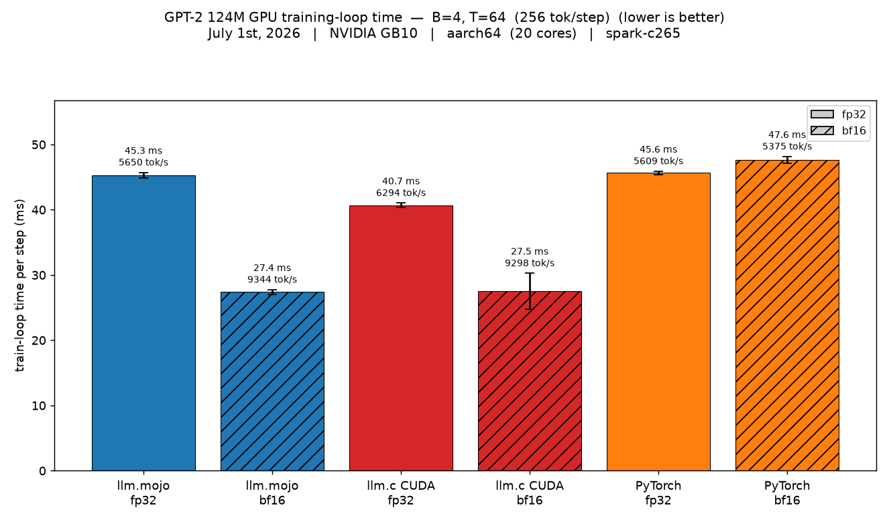
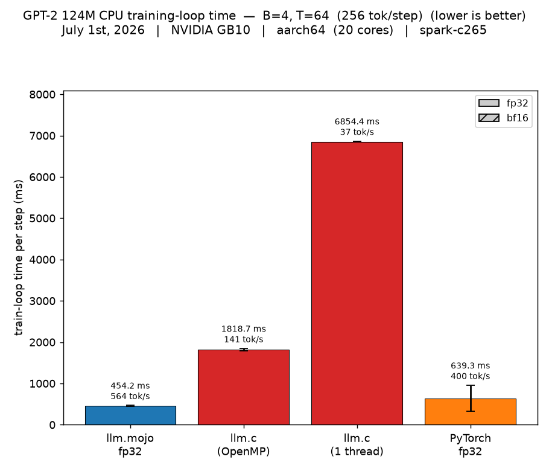
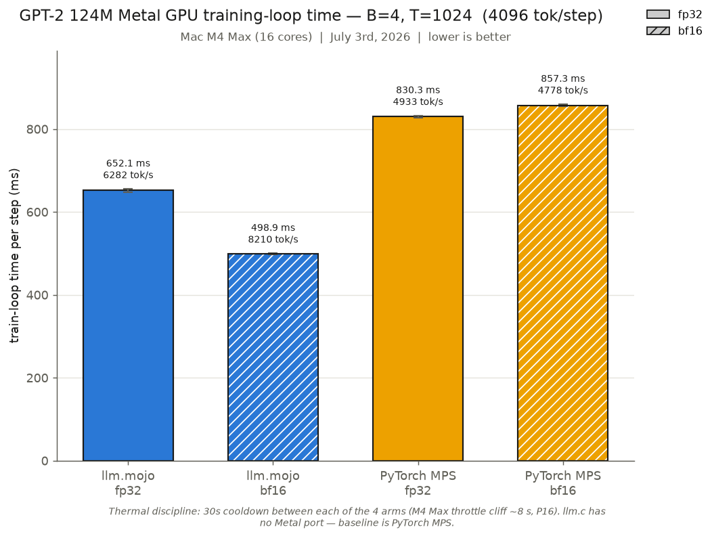
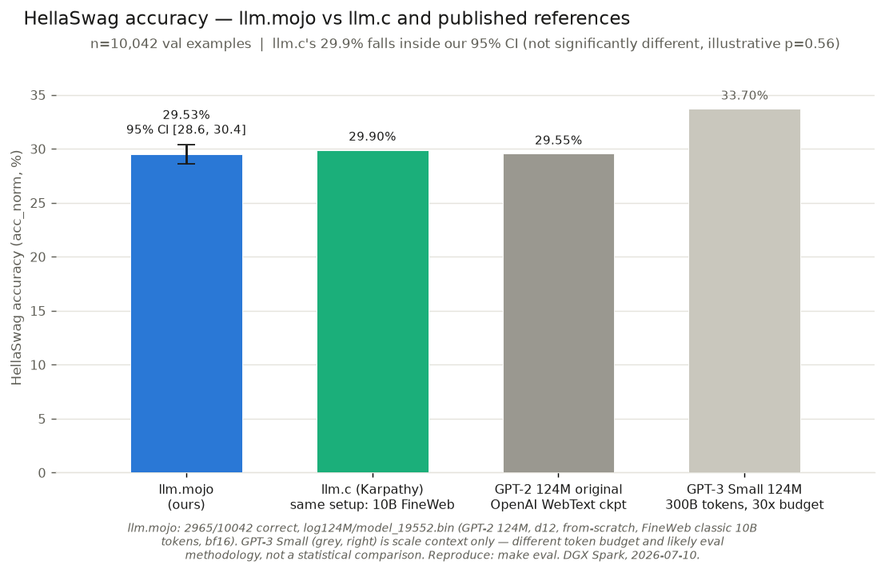
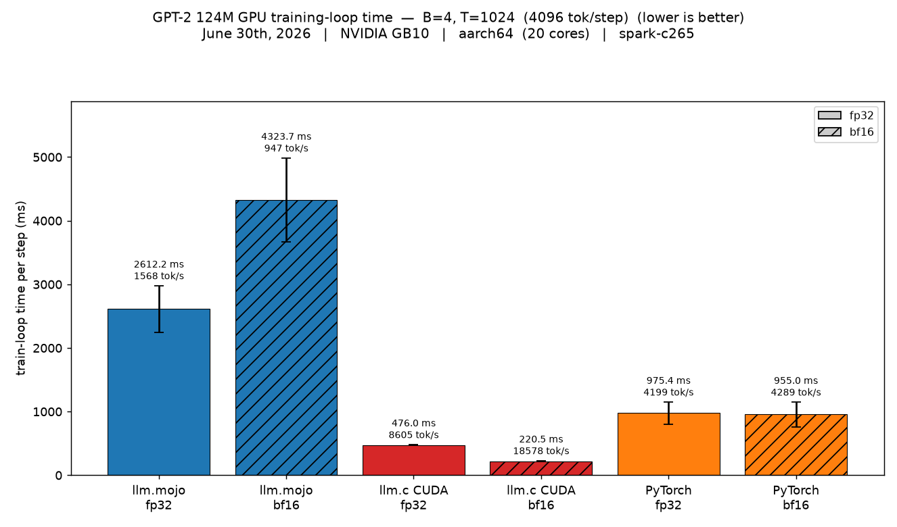

# LLM.🔥

This project is my port of Andrej Karpathy's [llm.c](https://github.com/karpathy/llm.c) that extends the GPU kernel functionality of @dorjeduck's [llm.🔥](https://github.com/dorjeduck/llm.mojo) in honor of [Mojo's](https://mojolang.org) v1.0.0 release (this project tracks the 1.0.0b3 nightly). The headline results: bf16 parity with llm.c's CUDA path on an NVIDIA GB10, and 1.72× faster than PyTorch MPS bf16 on an Apple M4 Max (see [Benchmarks](#benchmarks)). Visit [llm.c](https://github.com/karpathy/llm.c) for a detailed explanation of the original project.

> **Note**: This project is based on nightly Mojo 1.0.0b3 release.

## Installation

### Step 1: Clone the repository

This project vendors Karpathy's `llm.c` as a git submodule (used as the CPU/GPU
reference for benchmarking), so clone with `--recurse-submodules`:

```bash
git clone --recurse-submodules https://github.com/ulmentflam/llm.mojo.git
cd llm.mojo
```

If you already cloned without that flag, run `git submodule update --init` from
the repo root (the Makefile also does this automatically the first time a
`benchmark`/`profile-llmc-*` target needs it).

### Step 2: Install Pixi

If you don't have it, install [pixi](https://pixi.sh/latest/):

```bash
curl -fsSL https://pixi.sh/install.sh | sh
```

### Step 3: Install Dependencies and Git Hooks

Quick setup: pixi environment + git `pre-commit`/`pre-push` hooks (which run
`make lint` and `make check` respectively; see `make install-hooks`; requires
[pre-commit](https://pre-commit.com/) to already be on your `PATH`, and is
skipped, not fatal, if not found):

```bash
make install
```

If you have CUDA available and installed (beyond the scope of this file), use
the CUDA-enabled equivalent instead:
```bash
make install-cuda
```

`make install`/`make install-cuda` do **not** download the Tiny Shakespeare
dataset or GPT-2 124M starter weights (~1.5 GB). That's a separate step,
needed before `make train`, `make verify`, or `make benchmark*` will work:

```bash
make data
```

Or combine both in one shot with `make install-with-data` (or
`make install-cuda-with-data` for the CUDA variant).

### Step 4: Train

```bash
make train
```

For additional help, see `make help`.

## Benchmarks

Benchmark Results: (NVIDIA DGX Spark)

Average training loop times across llm.mojo, llm.c, and PyTorch, all with matched hyperparameters in an apples-to-apples comparison. llm.c runs OpenMP-enabled with 20 threads. CPU comparisons are float32, and GPU comparisons run both float32 and bfloat16. On Apple Silicon, `make benchmark-metal` runs llm.mojo (Metal GPU) against PyTorch MPS (llm.c has no Metal port, so PyTorch MPS fills in as the baseline). See the [Apple Silicon (Metal GPU)](#apple-silicon-metal-gpu) section for those results.

### Single GPU



### Single CPU



### Apple Silicon (Metal GPU)

I ported this to Metal GPU on Apple Silicon as well. The initial Metal port came in around 3627 ms/step, about 4.1× slower than PyTorch MPS at the time. After a round of kernel work it landed at 498.9 ms in bf16, which is 1.72× faster. Official run on an M4 Max (B=4, T=1024, cold GPU, 30 s inter-arm cooldowns, 2026-07-03):

| configuration | mean ms/step | tok/s | vs PyTorch MPS |
|---|---:|---:|---|
| llm.mojo bf16 | **498.9** | **8210** | **1.72× faster** (vs MPS bf16) |
| llm.mojo fp32 | 652.1 | 6282 | **1.27× faster** (vs MPS fp32) |
| PyTorch MPS fp32 | 830.3 | 4933 | baseline |
| PyTorch MPS bf16 | 857.3 | 4778 | baseline |



Run `make benchmark-metal` to reproduce. It runs all four arms in one shot, with 30 s cooldowns between them (the M4 Max throttles after ~8 s of sustained GPU load, so these are not optional). Correctness is gated by `make test`, which checks 16 gradient tensors plus the 10-step loss trajectory against PyTorch. The full gotcha catalog (address-space bugs, in-order queue semantics, threadgroup limits, the correctness campaign) is in [`docs/ai/metal_port_gotchas_and_optimizations.md`](docs/ai/metal_port_gotchas_and_optimizations.md), and the benchmarking setup is in `docs/ai/ai_assisted_optimizations_and_benchmarks.md`.

## Evaluation

`make eval` scores a checkpoint on HellaSwag (via our own `llmm/eval_dataloader.mojo` + `infer_gpt2.mojo`, ported from llm.c's `EvalLoader`) and prints `k/n = accuracy`. Our from-scratch GPT-2 124M (10B FineWeb tokens, bf16) scores **2965/10042 = 29.53%** (acc_norm), with a Wilson 95% CI of **[28.6%, 30.4%]** — Karpathy's own llm.c reproduction of the identical setup (124M, d12, 10B FineWeb tokens; [discussion #481](https://github.com/karpathy/llm.c/discussions/481)) reports 29.9%, which falls comfortably inside that interval: statistically indistinguishable from our own measurement, not just "close."

This checkpoint is published on HuggingFace: **[ulmentflam/gpt2-124m-fineweb-mojo](https://huggingface.co/ulmentflam/gpt2-124m-fineweb-mojo)** (safetensors + the original raw `llm.mojo`/`llm.c`-format checkpoint). `infer_gpt2.mojo` can load it three ways — a local `.bin`, a local `.safetensors`, or straight from the Hub (`--hf ulmentflam/gpt2-124m-fineweb-mojo`) — see `llmm/safetensors.mojo` / `llmm/hf_download.mojo`. Full training-run details (hyperparameters, timeline, hardware) are in [`docs/ai/gpt2_124m_fineweb_training_run.md`](docs/ai/gpt2_124m_fineweb_training_run.md).



Run `make benchmark-eval` to reproduce this chart (it runs `make eval` and computes the Wilson CI); pass `--k`/`--n` to `scripts/benchmark_eval.py` directly to re-render from a cached result instead of re-scoring the full 10,042-example split. GPT-2 124M original and GPT-3 Small are included as scale/methodology context, not statistical comparisons — see the script's docstring for why.

## Test

We ported `test_gpt2.c` from the original repository to validate our port's functionality. We also have a full verification suite available via make.

> **Note**: `make test` checks activations as well as gradients, so it needs reference files regenerated by the PyTorch script (`pixi run python train_gpt2.py`), a one-time step on a fresh clone. The starter-pack debug state downloaded by `make data` is llm.c's activation-free format and is not sufficient. `make train` works with the downloaded starter pack directly.

### Run Tests

```bash
make test
```

### Run Verification

```bash
make verify
```

## Development Roadmap
Future development includes:

1. Full ZeRO-3 verification
2. Mamba1/Mamba2/Mamba3 architecture and MoE

## Motivation

LLMs in Mojo without the need for PyTorch or CPython. Inspired by Karpathy's [llm.c](https://github.com/karpathy/llm.c), with a focus on proving out the viability of autograd in pure Mojo syntax. The focus is to reproduce GPT-2 and GPT-3 alongside a parallel PyTorch reference in `train_gpt*.py`.

A personal goal of this project is to write all kernel and main Python code without using any LSPs or LLMs, writing every algorithm (forward and backpropagation) from scratch. I received feedback recently that my "coding and math expertise" is not strong enough, and building out this framework is how I intend to strengthen those skills. Just like writing a compiler, writing the fundamentals of generative models from scratch sharpens both engineering and mathematics.

As part of that goal, I will be leveraging NVIDIA Nsight and Perfetto for performance analysis and comparison against my PyTorch implementation of GPT-2. As the project evolves, I will include benchmarking results and other insights into the performance comparisons between Mojo, PyTorch, and even Karpathy's C implementation.

In order to speed up testing, I decided to leverage LLMs/AI to help write and accelerate runtime of test cases. All of the code in `llmm/` and the root directory is written by hand, but the tests have been aided by LSPs and LLMs in order to accelerate writing them. I also use the formatter and compiler to typecheck, but that has always been the case.

## Thanks

A special thanks to https://github.com/dorjeduck/llm.mojo and @dorjeduck for writing the original implementation of llm.mojo in Mojo 25.5.

## Agentic Optimizations

After I reached functional success, my kernels were dramatically underperforming Karpathy and PyTorch. I did the initial profiling and caught that attention was the initial bottleneck. After a few attempts at writing a more optimal attention kernel, I decided to leverage AI agents for optimizing the kernel. Originally I leveraged Google Gemini, and after quickly running out of credits, I decided to leverage OpenCode and NVIDIA Nemotron 3 Ultra. After Nemotron 3 struggled for a few days on the optimization, I pivoted to Claude Opus (and more recently Fable) to optimize the kernel, eventually reaching parity in bfloat16. The full exploration is documented in `docs/ai/ai_assisted_optimizations_and_benchmarks.md`. My initial results are documented below:



## Changelog

See [CHANGELOG.md](CHANGELOG.md) for a detailed history of notable changes to this project.

## License

This project is licensed under the [MIT License](LICENSE).
