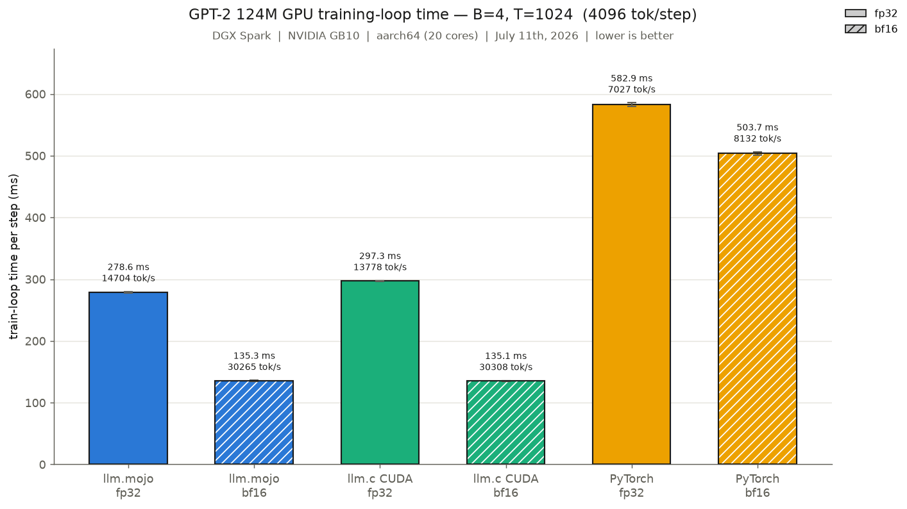
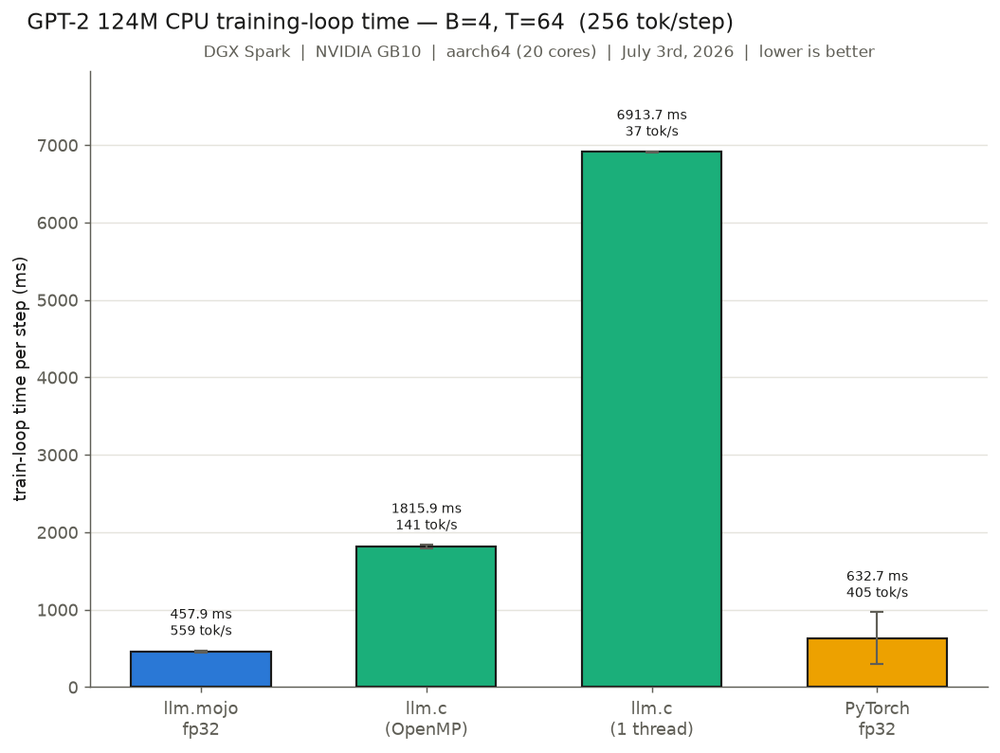
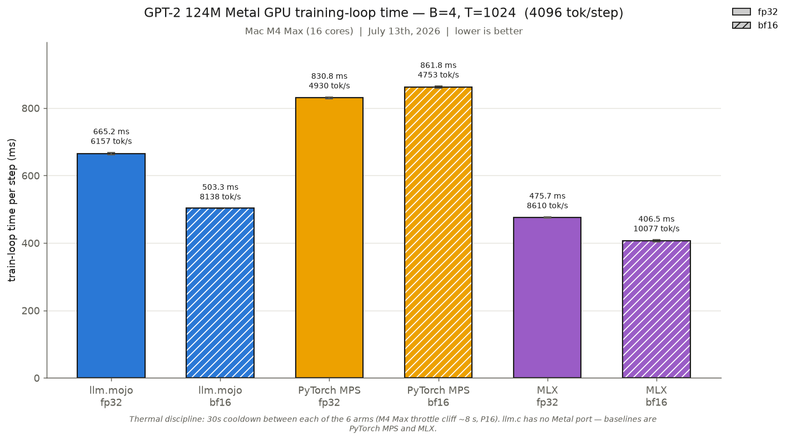
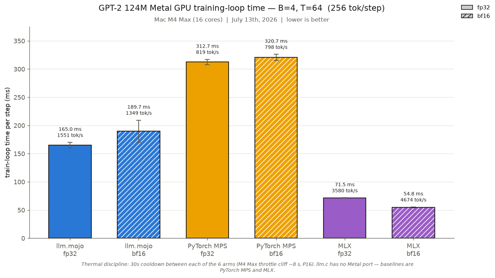

# LLM.🔥

This is my port of Andrej Karpathy's [llm.c](https://github.com/karpathy/llm.c), extending the GPU kernels of @dorjeduck's [llm.🔥](https://github.com/dorjeduck/llm.mojo) in honor of [Mojo's](https://mojolang.org) v1.0.0 release (this project tracks the 1.0.0b3 nightly). The headline results:

- On an NVIDIA GB10, it matches or beats llm.c's CUDA path at both training precisions (bf16 parity, fp32 ~7% faster with TF32).
- On an Apple M4 Max, it runs 1.71× faster than PyTorch MPS bf16, though Apple's own MLX is faster still (see [Benchmarks](#benchmarks)).
- It adds working FP8 (e4m3/e5m2) and NVFP4 (e2m1) low-precision training alongside bf16/fp32.

See [llm.c](https://github.com/karpathy/llm.c) for a detailed explanation of the original project.

> **Note**: This project is based on nightly Mojo 1.0.0b3 release.

## Installation

### Step 1: Clone the repository

This project vendors Karpathy's `llm.c` as a git submodule (used as the CPU/GPU
reference for benchmarking), so clone with `--recurse-submodules`:

```bash
git clone --recurse-submodules https://github.com/ulmentflam/llm.mojo.git
cd llm.mojo
```

If you already cloned without that flag, run `git submodule update --init` from
the repo root (the Makefile also does this automatically the first time a
`benchmark`/`profile-llmc-*` target needs it).

### Step 2: Install Pixi

If you don't have it, install [pixi](https://pixi.sh/latest/):

```bash
curl -fsSL https://pixi.sh/install.sh | sh
```

### Step 3: Install Dependencies and Git Hooks

Quick setup: pixi environment + git `pre-commit`/`pre-push` hooks (which run
`make lint` and `make check` respectively; see `make install-hooks`; requires
[pre-commit](https://pre-commit.com/) to already be on your `PATH`, and is
skipped, not fatal, if not found):

```bash
make install
```

If you have CUDA available and installed (beyond the scope of this file), use
the CUDA-enabled equivalent instead:
```bash
make install-cuda
```

`make install`/`make install-cuda` do **not** download the Tiny Shakespeare
dataset or GPT-2 124M starter weights (~1.5 GB). That's a separate step,
needed before `make train`, `make verify`, or `make benchmark*` will work:

```bash
make data
```

Or combine both in one shot with `make install-with-data` (or
`make install-cuda-with-data` for the CUDA variant).

### Step 4: Train

```bash
make train
```

For additional help, see `make help`.

For a long-running training run you want to survive crashes/reboots
unattended, supervise it with [autosentry](https://github.com/ulmentflam/autosentry)
(a self-healing process supervisor: checkpoint-resume on restart, OOM
batch-halving, Claude-agent escalation on unrecognized failures) via this
repo's `.autosentry/autosentry.yaml`, `scripts/run_train_gpt2_bf16.sh`, and
`scripts/ensure_supervisor.sh`. See
[`docs/ai/gpt2_124m_fineweb_training_run.md`](docs/ai/gpt2_124m_fineweb_training_run.md)
for a full worked example.

## Benchmarks

Benchmark Results: (NVIDIA DGX Spark)

Average training loop times across llm.mojo, llm.c, and PyTorch, all with matched hyperparameters in an apples-to-apples comparison. llm.c runs OpenMP-enabled with 20 threads. CPU comparisons are float32, and GPU comparisons run both float32 and bfloat16. On Apple Silicon, `make benchmark-metal` runs llm.mojo (Metal GPU) against PyTorch MPS (llm.c has no Metal port, so PyTorch MPS fills in as the baseline). See the [Apple Silicon (Metal GPU)](#apple-silicon-metal-gpu) section for those results.

### Single GPU

Official run on the GB10 (B=4, T=1024, 40 steps with the first 5 dropped as warmup, all six arms interleaved in one session, 2026-07-11 15:31, measured directly on the shipped tree, HEAD `c1a48d5`, after the Metal test-restoration + MLX-benchmark merge; confirms the 2026-07-10 post-campaign table within noise, all six arms within 1.7% of it):

| configuration | mean ms/step | tok/s | vs llm.c |
|---|---:|---:|---|
| llm.mojo bf16 | **135.34** | **30265** | parity (0.999× vs llm.c bf16, ≈noise) |
| llm.c CUDA bf16 | 135.14 | 30308 | baseline (bf16) |
| llm.mojo fp32 (TF32) | **278.57** | **14704** | **1.07× faster** (vs llm.c fp32) |
| llm.c CUDA fp32 (TF32) | 297.29 | 13778 | baseline (fp32) |
| PyTorch bf16 | 503.71 | 8132 | — |
| PyTorch fp32 | 582.89 | 7027 | — |



> **TF32 note**: llm.mojo's fp32 GPU GEMMs now use TF32 tensor cores by default (`CUBLAS_COMPUTE_32F_FAST_TF32`), matching llm.c's fp32 behavior: its fp32 build auto-enables TF32 on any compute-capability-8.0+ GPU, so the fp32 rows above are TF32-vs-TF32. Build with `-D LLMM_NO_TF32=1` to restore strict IEEE fp32 math (that is also what `make verify-gpu` gates on; the default TF32 path has its own gate, `make verify-gpu-tf32`).

> **Backward-kernel note**: the 07-10 afternoon numbers add two backward-pass optimizations on top of TF32: a redesigned fused LN-backward (one register-accumulating kernel plus a block-per-channel finalize, replacing 4 launches per invocation; −6.9 ms fp32 / −3.1 ms bf16 kernel-family time) and a fused, 128-bit-vectorized matmul dbias reduction (−1.5 ms fp32 / −1.0 ms bf16). Both are gated by the full verify battery above.

### Low-precision training (FP8 / NVFP4)

FP8 and NVFP4 are working training precisions, not just inference formats. FP8 quantizes the per-block linear GEMMs (QKV/attn-proj/MLP fc/fc-proj, forward and backward) to transient e4m3/e5m2 operands with delayed scaling. The math runs in FP8 tensor cores, but the master weights and optimizer state stay in fp32. NVFP4 block-scales the middle transformer blocks' MLP GEMMs to e2m1 on cuBLASLt. It adds stochastic rounding and a random Hadamard transform (per the published NVFP4 training recipe) to control the extra quantization variance. Both converge alongside bf16 at GPT-2 124M scale. See the loss envelopes below and `make verify-fp8-grads` / the fp8/fp4 gates in `docs/ai/ai_assisted_optimizations_and_benchmarks.md`.

Step-time measurement (B=4, T=1024, checkpoint-init tinyshakespeare, 2 rounds with arm order alternated per round, 40 measured steps/arm after a discarded fresh-binary warmup run, 2026-07-11, post-optimization-campaign tree):

| precision | median ms/step | vs bf16 | 50-step loss envelope vs bf16 | build target |
|---|---:|---:|---:|---|
| bf16 | 134.9 | baseline | baseline | `make build-bf16` |
| FP8 (e4m3/e5m2) | 146.6 | 1.09× slower | median 0.57% | `make build-fp8` |
| NVFP4 (e2m1) | 154.3 | 1.14× slower | median 0.89% | `make build-fp4` |

The 2026-07-10/11 optimization campaign (coalesced/fused quantize-transpose kernels, persistent fp8 weight-transpose caching, dual-output quantize, fused tiled RHT-prep for NVFP4) cut FP8 from 150.5 to 146.6 ms and NVFP4 from 184.2 to 154.3 ms at this scale. It pays off harder at width: at the 774M-class `d36` config FP8 is now ~12% *faster* than bf16 (0.878×), and NVFP4 reaches parity (1.002×). An optional calibrated static-scales mode (`-D LLMM_FP8_STATIC_SCALES=1`, default off) removes the per-step amax/scale-update kernels entirely. It shaves a further ~1.5% at 124M and ~3% at `d36` (0.853×), at the cost of per-config offline calibration. See the A1 writeup and the final campaign scoreboard in `docs/ai/ai_assisted_optimizations_and_benchmarks.md`.

At 124M params, these are numerics/research configs, not throughput wins. The quantized GEMMs themselves are measurably faster than bf16's, since fp8 and fp4 both cut raw GEMM compute time. At this scale, though, that saving is swamped by the quantize/amax/scale overhead (plus the Hadamard transform for NVFP4) around small per-block GEMMs. See the quant-opt and transpose-coalescing writeups in `docs/ai/ai_assisted_optimizations_and_benchmarks.md` and the FP8/FP4 gotcha catalogs. Published FP4/FP8 throughput wins start around ~1B+ parameter models, where the GEMMs are large enough to amortize that fixed overhead.

A batch/width scaling sweep confirms this on-box. At 124M, FP8 stays slower than bf16 across every batch size tested (B up to 64). Scale the model up to the 774M-class `d36` config, though, and it crosses over to being decisively *faster* (0.878× dynamic, 0.853× static after the campaign). Width, not batch, is what closes the gap; see `docs/ai/lowp_scaling_sweep_2026-07-10.md`.

### Single CPU

CPU training is fp32 by policy. Official run (B=4, T=64, 2026-07-03):

| configuration | mean ms/step | tok/s | vs llm.c OpenMP |
|---|---:|---:|---|
| llm.mojo fp32 | **457.9** | **559** | **4.0× faster** |
| llm.c OpenMP (20 threads) | 1815.9 | 141 | baseline |
| llm.c (1 thread) | 6913.7 | 37 | — |
| PyTorch fp32 | 632.7 | 405 | — |



### Apple Silicon (Metal GPU)

I ported this to the Metal GPU on Apple Silicon as well. The first working port ran at about 3627 ms/step (roughly 4.1× slower than PyTorch MPS); a round of kernel work moved it well ahead of PyTorch's Metal path at both precisions. Official run on an M4 Max (B=4, cold GPU, 30 s inter-arm cooldowns, 2026-07-13), at the full training sequence length T=1024:

| configuration | mean ms/step | tok/s | vs PyTorch MPS | vs MLX |
|---|---:|---:|---|---|
| llm.mojo bf16 | **503.3** | **8138** | **1.71× faster** (MPS bf16) | 1.24× slower |
| llm.mojo fp32 | 665.2 | 6157 | **1.25× faster** (MPS fp32) | 1.40× slower |
| PyTorch MPS fp32 | 830.8 | 4930 | baseline | — |
| PyTorch MPS bf16 | 861.8 | 4753 | baseline | — |
| MLX fp32 | 475.7 | 8610 | — | baseline |
| MLX bf16 | 406.5 | 10077 | — | baseline |



At the short benchmark length T=64 (same machine, same session), llm.mojo stays well ahead of PyTorch MPS, and MLX pulls further out front: the M4 Max's large GPU clears the tiny T=64 workload almost instantly under MLX.

| configuration | mean ms/step | tok/s | vs PyTorch MPS | vs MLX |
|---|---:|---:|---|---|
| llm.mojo fp32 | 165.0 | 1551 | **1.90× faster** | 2.3× slower |
| llm.mojo bf16 | 189.7 | 1349 | **1.69× faster** | 3.5× slower |
| PyTorch MPS fp32 | 312.7 | 819 | baseline | — |
| PyTorch MPS bf16 | 320.7 | 798 | baseline | — |
| MLX fp32 | 71.5 | 3580 | — | baseline |
| MLX bf16 | 54.8 | 4674 | — | baseline |



On Apple Silicon, llm.mojo runs faster than PyTorch's Metal (MPS) path at both sequence lengths, while Apple's own MLX is faster than both. The difference is almost entirely the matmul, which is about 70% of a training step: on Metal, MAX's `linalg.matmul` runs bf16 at only about 1.1× its fp32 speed, while MLX's bf16 uses tensor cores for roughly 2× (see `bench_gemm.mojo` and [`docs/ai/metal_beat_mlx_campaign_2026-07-11.md`](docs/ai/metal_beat_mlx_campaign_2026-07-11.md)).

Run `make benchmark-metal` to reproduce (add `BENCH_T=64` for the short-sequence table). It runs all six arms in one shot (llm.mojo fp32/bf16, PyTorch MPS fp32/bf16, MLX fp32/bf16) with 30 s cooldowns between them (the M4 throttles after about 8 s of sustained GPU load, so these are not optional). Correctness is gated by `make test`, which checks 16 gradient tensors plus the 10-step loss trajectory against PyTorch. The full gotcha catalog (address-space bugs, in-order queue semantics, threadgroup limits, the correctness campaign) is in [`docs/ai/metal_port_gotchas_and_optimizations.md`](docs/ai/metal_port_gotchas_and_optimizations.md), and the benchmarking setup is in `docs/ai/ai_assisted_optimizations_and_benchmarks.md`.

## Evaluation

`make eval` scores a checkpoint on HellaSwag (via our own `llmm/eval_dataloader.mojo` + `infer_gpt2.mojo`, ported from llm.c's `EvalLoader`) and prints `k/n = accuracy`. Our from-scratch GPT-2 124M (10B FineWeb tokens, bf16) scores **2965/10042 = 29.53%** (acc_norm), with a Wilson 95% CI of **[28.6%, 30.4%]**. Karpathy's own llm.c reproduction of the identical setup (124M, d12, 10B FineWeb tokens; [discussion #481](https://github.com/karpathy/llm.c/discussions/481)) reports 29.9%, which falls comfortably inside that interval: statistically indistinguishable from our own measurement, not just "close."

This checkpoint is published on HuggingFace: **[ulmentflam/gpt2-124m-fineweb-mojo](https://huggingface.co/ulmentflam/gpt2-124m-fineweb-mojo)** (safetensors + the original raw `llm.mojo`/`llm.c`-format checkpoint). `infer_gpt2.mojo` can load it three ways: a local `.bin`, a local `.safetensors`, or straight from the Hub (`--hf ulmentflam/gpt2-124m-fineweb-mojo`). See `llmm/safetensors.mojo` / `llmm/hf_download.mojo`. Full training-run details (hyperparameters, timeline, hardware) are in [`docs/ai/gpt2_124m_fineweb_training_run.md`](docs/ai/gpt2_124m_fineweb_training_run.md).


Run `make benchmark-eval` to reproduce this chart (it runs `make eval` and computes the Wilson CI); pass `--k`/`--n` to `scripts/benchmark_eval.py` directly to re-render from a cached result instead of re-scoring the full 10,042-example split. GPT-2 124M original and GPT-3 Small are included as scale/methodology context, not statistical comparisons. See the script's docstring for why.

## Test

We ported `test_gpt2.c` from the original repository to validate our port. A full verification suite is also available via make.

> **Note**: `make test` checks activations as well as gradients, so it needs reference files regenerated by the PyTorch script (`pixi run python train_gpt2.py`), a one-time step on a fresh clone. The starter-pack debug state downloaded by `make data` is llm.c's activation-free format and is not sufficient. `make train` works with the downloaded starter pack directly.

### Run Tests

```bash
make test
```

### Run Verification

```bash
make verify
```

## Development Roadmap
Future development includes:

1. Full ZeRO-3 verification
2. Mamba1/Mamba2/Mamba3 architecture and MoE

## Motivation

LLMs in Mojo without the need for PyTorch or CPython. Inspired by Karpathy's [llm.c](https://github.com/karpathy/llm.c), with a focus on proving out the viability of autograd in pure Mojo syntax. The focus is to reproduce GPT-2 and GPT-3 alongside a parallel PyTorch reference in `train_gpt*.py`.

A personal goal is to write all kernel and main Python code without any LSPs or LLMs, writing every algorithm (forward and backpropagation) from scratch. I received feedback recently that my "coding and math expertise" is not strong enough, and building out this framework is how I intend to strengthen those skills. Just like writing a compiler, writing the fundamentals of generative models from scratch sharpens both engineering and mathematics.

As part of that goal, I use NVIDIA Nsight and Perfetto for performance analysis and comparison against my PyTorch implementation of GPT-2. As the project evolves, I will include benchmarking results and other insights into the performance comparisons between Mojo, PyTorch, and even Karpathy's C implementation.

To speed up testing, I used LLMs/AI to help write the test cases and accelerate their runtime. All of the code in `llmm/` and the root directory is written by hand, but the tests have been aided by LSPs and LLMs to accelerate writing them. I also use the formatter and compiler to typecheck, but that has always been the case.

## Agentic Optimizations

After I reached functional success, my kernels were dramatically underperforming Karpathy and PyTorch. I did the initial profiling and caught that attention was the initial bottleneck. After a few attempts at writing a more optimal attention kernel, I decided to bring in AI agents. I started with Google Gemini, and after quickly running out of credits, moved to OpenCode and NVIDIA Nemotron 3 Ultra. When Nemotron 3 struggled for a few days on the optimization, I pivoted to Claude Opus (and more recently Fable), eventually reaching parity in bfloat16 (and later, with TF32 enabled on the fp32 GEMMs plus a round of backward-kernel fusion, pulling ~7% ahead of llm.c in float32 too). The full exploration is documented in `docs/ai/ai_assisted_optimizations_and_benchmarks.md`. My initial results are documented below:


## Thanks

A special thanks to https://github.com/dorjeduck/llm.mojo and @dorjeduck for writing the original implementation of llm.mojo in Mojo 25.5.

## Changelog

See [CHANGELOG.md](CHANGELOG.md) for a detailed history of notable changes to this project.

## License

This project is licensed under the [MIT License](LICENSE).
