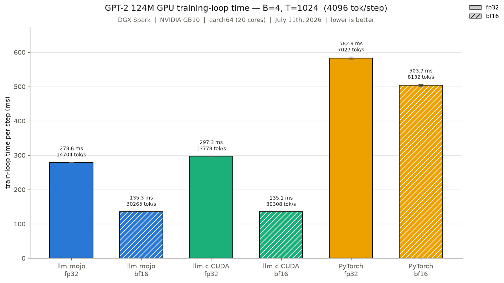
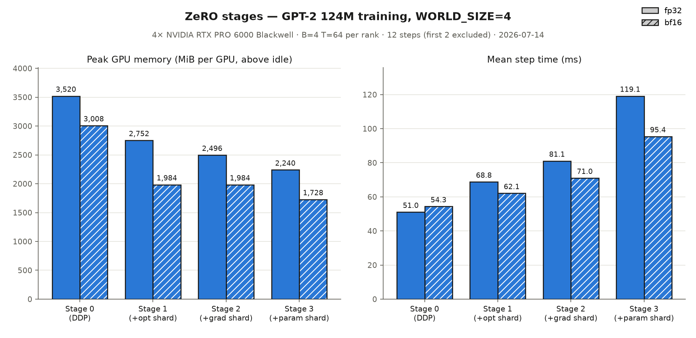
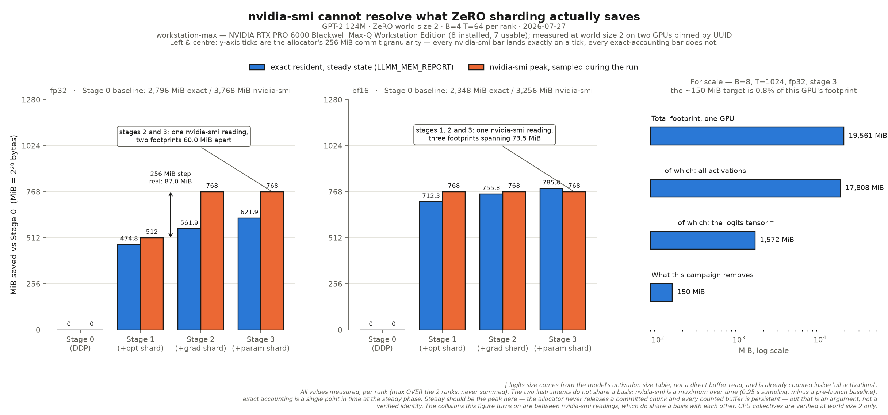
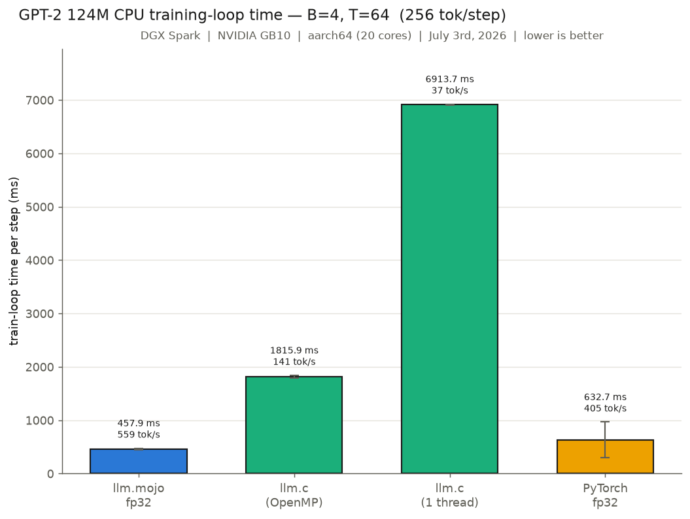
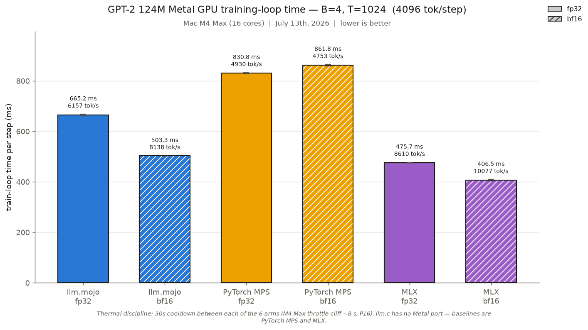
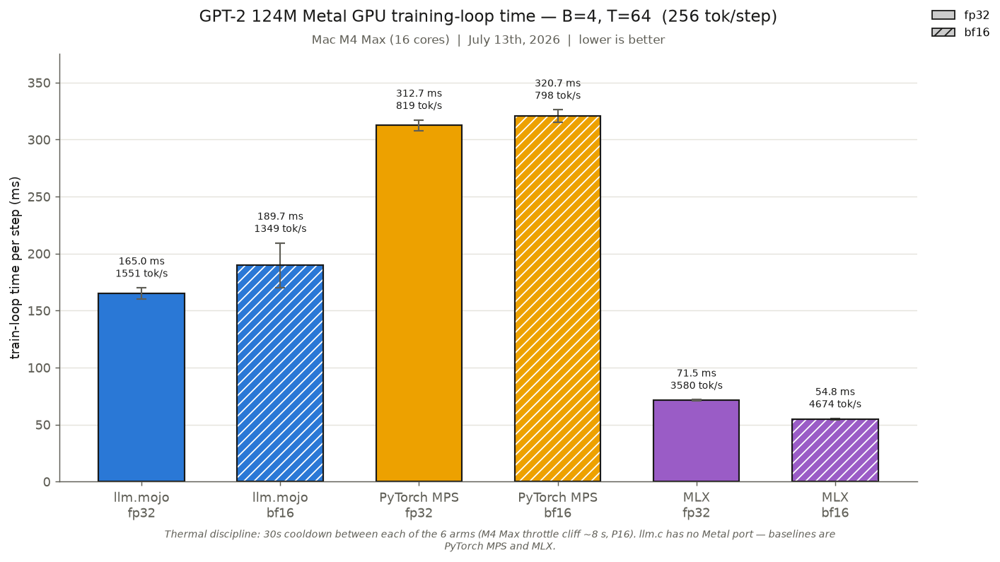
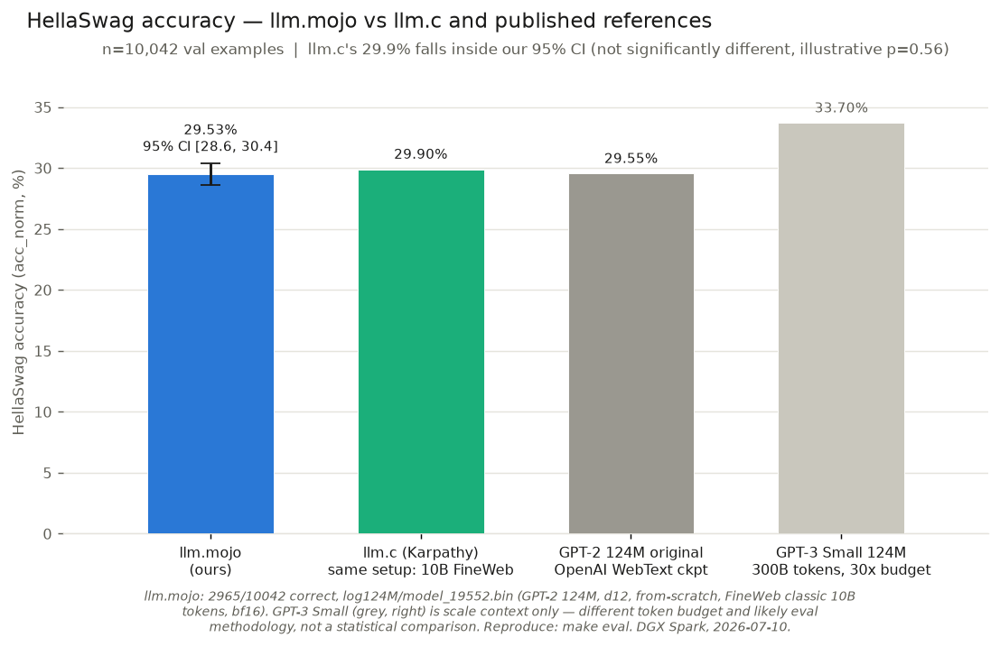
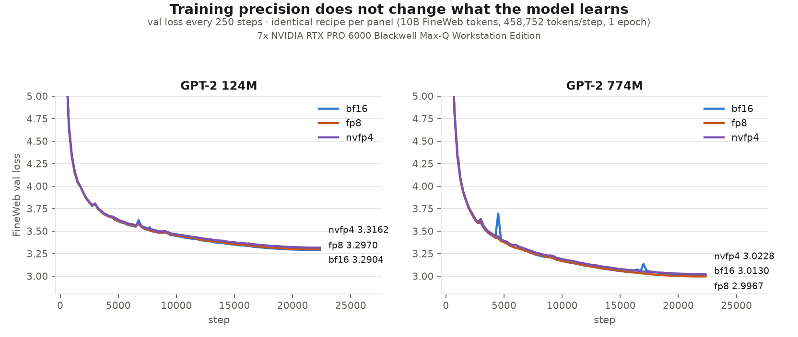
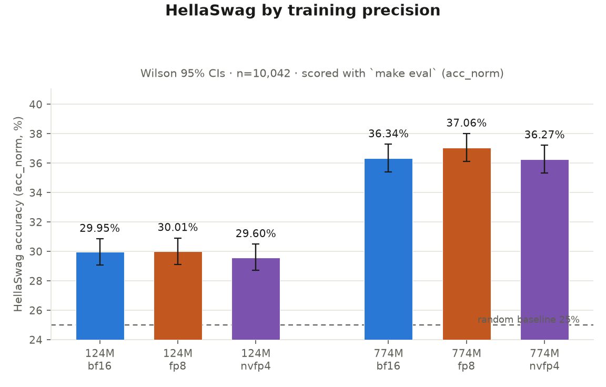
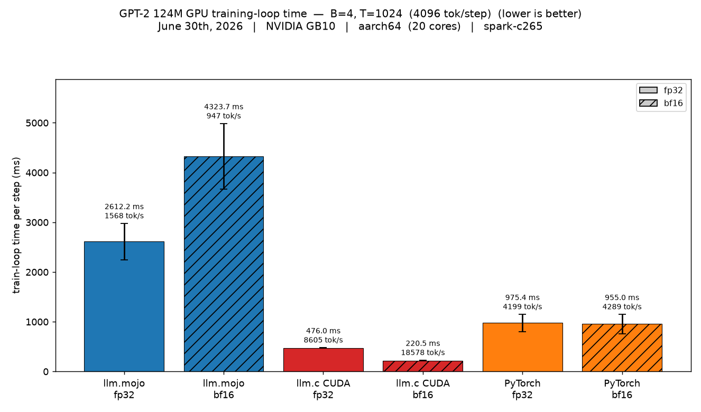

# LLM.🔥

This is my port of Andrej Karpathy's [llm.c](https://github.com/karpathy/llm.c), extending the GPU kernels of @dorjeduck's [llm.🔥](https://github.com/dorjeduck/llm.mojo) in honor of [Mojo's](https://mojolang.org) v1.0.0 release (this project tracks the 1.0.0b3 nightly). The headline results:

- On an NVIDIA GB10, it matches or beats llm.c's CUDA path at both training precisions (bf16 parity, fp32 ~7% faster with TF32).
- On an Apple M4 Max, it runs 1.71× faster than PyTorch MPS bf16, though Apple's own MLX is faster still (see [Benchmarks](#benchmarks)).
- It adds working FP8 (e4m3/e5m2) and NVFP4 (e2m1) low-precision training alongside bf16/fp32.

See [llm.c](https://github.com/karpathy/llm.c) for a detailed explanation of the original project.


*Real time (2x where marked, M4 Max). `make verify` checks every gradient tensor and a 10-step loss
trajectory against PyTorch, then `make train ARGS='-x 40 -b 4 -t 64 -l 1e-4 -m 5 -s 40'` reproduces
llm.c's canonical 40-step run batch-for-batch (same mt19937 shuffle order; val loss 5.3255 → 4.2922
vs llm.c's 5.3255 → 4.2915).*

## Installation

### Step 1: Clone the repository

This project vendors Karpathy's `llm.c` as a git submodule (used as the CPU/GPU
reference for benchmarking), so clone with `--recurse-submodules`:

```bash
git clone --recurse-submodules https://github.com/ulmentflam/llm.mojo.git
cd llm.mojo
```

If you already cloned without that flag, run `git submodule update --init` from
the repo root (the Makefile also does this automatically the first time a
`benchmark`/`profile-llmc-*` target needs it).

### Step 2: Install Pixi

If you don't have it, install [pixi](https://pixi.sh/latest/):

```bash
curl -fsSL https://pixi.sh/install.sh | sh
```

### Step 3: Install Dependencies and Git Hooks

Quick setup: pixi environment + git `pre-commit`/`pre-push` hooks (which run
`make lint` and `make check` respectively; see `make install-hooks`; requires
[pre-commit](https://pre-commit.com/) to already be on your `PATH`, and is
skipped, not fatal, if not found):

```bash
make install
```

If you have CUDA installed (setup is beyond the scope of this file), use
the CUDA-enabled equivalent instead:
```bash
make install-cuda
```

`make install`/`make install-cuda` do **not** download the Tiny Shakespeare
dataset or GPT-2 124M starter weights (~1.5 GB). That's a separate step,
needed before `make train`, `make verify`, or `make benchmark*` will work:

```bash
make data
```

Or combine both in one shot with `make install-with-data` (or
`make install-cuda-with-data` for the CUDA variant).

### Step 4: Train

```bash
make train
```

For additional help, see `make help`.

Multi-GPU training: build with `WORLD_SIZE=N` (one rank per GPU, compile-time)
and choose a ZeRO sharding stage at runtime:

```bash
make build WORLD_SIZE=8
scripts/run_train_gpt2.sh -z 2   # ZeRO: 0=DDP, 1=+opt shard, 2=+grad shard, 3=+param shard
```

Or launch from one of the baseline stage configs in [`zero/`](zero/README.md)
(DeepSpeed-style: `zero1.json`/`zero2.json`/`zero3.json`), which handles the
build + run pair in one step:

```bash
make train-zero ZERO_CONFIG=zero/zero2.json
```

To pretrain on FineWeb instead of Tiny Shakespeare, tokenize it first
(`--streaming` avoids the ~60 GB Arrow materialization on small-disk hosts):

```bash
pixi run python data/fineweb.py -t classic -v 10B -m gpt-2 --streaming
```

For a long-running training run you want to survive crashes/reboots
unattended, supervise it with [autosentry](https://github.com/ulmentflam/autosentry)
(a self-healing process supervisor: checkpoint-resume on restart, OOM
batch-halving, Claude-agent escalation on unrecognized failures) via this
repo's `.autosentry/autosentry.yaml`, `scripts/run_train_gpt2_bf16.sh`, and
`scripts/ensure_supervisor.sh`. See
[`docs/ai/gpt2_124m_fineweb_training_run.md`](docs/ai/gpt2_124m_fineweb_training_run.md)
for a full worked example.

## Benchmarks

Benchmark Results: (NVIDIA DGX Spark)

Average training loop times across llm.mojo, llm.c, and PyTorch, all with matched hyperparameters. llm.c runs OpenMP-enabled with 20 threads. CPU comparisons are float32, and GPU comparisons run both float32 and bfloat16. On Apple Silicon, `make benchmark-metal` runs llm.mojo (Metal GPU) against PyTorch MPS (llm.c has no Metal port, so PyTorch MPS fills in as the baseline). See the [Apple Silicon (Metal GPU)](#apple-silicon-metal-gpu) section for those results.

### Single GPU

Official run on the GB10 (B=4, T=1024, 40 steps with the first 5 dropped as warmup, all six arms interleaved in one session, 2026-07-11 15:31, measured directly on the shipped tree, HEAD `c1a48d5`, after the Metal test-restoration + MLX-benchmark merge; confirms the 2026-07-10 post-campaign table within noise, all six arms within 1.7% of it):

| configuration | mean ms/step | tok/s | vs llm.c |
|---|---:|---:|---|
| llm.mojo bf16 | **135.34** | **30265** | parity (0.999× vs llm.c bf16, ≈noise) |
| llm.c CUDA bf16 | 135.14 | 30308 | baseline (bf16) |
| llm.mojo fp32 (TF32) | **278.57** | **14704** | **1.07× faster** (vs llm.c fp32) |
| llm.c CUDA fp32 (TF32) | 297.29 | 13778 | baseline (fp32) |
| PyTorch bf16 | 503.71 | 8132 | — |
| PyTorch fp32 | 582.89 | 7027 | — |



> **TF32 note**: llm.mojo's fp32 GPU GEMMs now use TF32 tensor cores by default (`CUBLAS_COMPUTE_32F_FAST_TF32`), matching llm.c's fp32 behavior: its fp32 build auto-enables TF32 on any compute-capability-8.0+ GPU, so the fp32 rows above are TF32-vs-TF32. Build with `-D LLMM_NO_TF32=1` to restore strict IEEE fp32 math (that is also what `make verify-gpu` gates on; the default TF32 path has its own gate, `make verify-gpu-tf32`).

> **Backward-kernel note**: the fp32 result above rests on two backward-pass optimizations layered on top of TF32: a redesigned fused LN-backward (one register-accumulating kernel plus a block-per-channel finalize, replacing 4 launches per invocation; −6.9 ms fp32 / −3.1 ms bf16 kernel-family time) and a fused, 128-bit-vectorized matmul dbias reduction (−1.5 ms fp32 / −1.0 ms bf16). Both are gated by the full verify battery above.

### Multi-GPU (ZeRO stages 0-3)

Multi-GPU data-parallel training runs one rank per GPU inside a single process: build with `make build WORLD_SIZE=N` (compile-time, like llm.c's `-DMULTI_GPU`) and pick the ZeRO stage at runtime with `-z 0|1|2|3`. Stage 0 is plain DDP, stage 1 shards optimizer state, stage 2 also shards gradients, and stage 3 also shards parameters. All four stages are equivalence-gated against the single-GPU baseline (`tests/test_zero_equivalence.mojo` at world sizes 2 and 8, per-parameter match to 1e-5; per-step training losses agree across stages to ~1e-4 at world size 8). The collectives are staged reduce-scatter/all-gather over driver-routed device-to-device copies, so they work on PCIe boxes without CUDA P2P or NVLink. See [`docs/ai/zero_multigpu_rewrite_2026-07-14.md`](docs/ai/zero_multigpu_rewrite_2026-07-14.md) for the design and [`docs/ai/zero_world8_verification_2026-07-14.md`](docs/ai/zero_world8_verification_2026-07-14.md) for the verification campaign.

Measured on 4× NVIDIA RTX PRO 6000 Blackwell Max-Q (96 GB, PCIe, no P2P), GPT-2 124M, B=4 T=64 per rank, 12 steps (first 2 dropped as warmup), after the stage-2/3 memory pass (per-layer gradient bucketing and stage-3 parameter streaming):



Each stage buys additional per-GPU memory. Stage 1's optimizer-state sharding saves 768 MiB in fp32 (1 GiB in bf16, where the fp32 master weights shard too), stage 2's bucketed backward reduction saves another 256 MiB, and stage 3's parameter streaming another 256 MiB. The savings trade against step time: stages 2 and 3 pay for their per-layer collectives, with stage 3's just-in-time parameter gathers costing the most. At this tiny benchmark shape that overhead is a large fraction of the 50 ms step; at production shapes (B≥32, T=1024, ~250-470 ms steps) it is a few percent. Reproduce with `make benchmark-zero` (`BENCH_ZERO_WORLD=N`; writes the JSON into `zero/bench/` and renders this chart into `figures/`).

**The tied `wte` embedding used to floor stages 2/3 at ~150 MiB.** One `[V_p, C]` tensor — 50304 × 768 = 147 MiB in fp32 — is both the token-embedding table and the LM-head weight, so it had two consumers with opposite access patterns: the LM head reads it *densely* as a GEMM weight, the encoder reads it *sparsely* by token-id row lookup. Each needed its own fix. The LM head is now vocab-tiled (`-D LLMM_LM_HEAD_VOCAB_TILES`, default 8), so backward holds and reduce-scatters one tile at a time; the encoder gradient is now row-sparse over a cross-rank union of the tokens actually present. The gradient-bucket pool drops from ~150 MiB to **27 MiB**, at which point `wte` is no longer the binding constraint at all — a transformer layer's 12 tensors are. Cost: **+0.60%** step time. Correctness is gated by `make verify-gpu` at the shipped default, where all 16 gradient tensors match PyTorch, `dwte` included.

**Read that in proportion.** At production shape the tensors that actually dominate a GPU are `att_probs` (~18 GiB, growing as T²) and `logits` (~6.1 GiB) — 123× and 42× the floor this work removed, and untouched by it. Removing 150 MiB is 0.7% of the footprint there, where activations are 88% of everything on the card. The floor was real and blocked stages 2/3 from doing what they exist to do, but the memory problem is not solved. Full accounting, including the measurement instrument this needed (`nvidia-smi` cannot resolve a 150 MiB change — the allocator commits in 256 MiB chunks) is in [`docs/ai/zero_wte_deresidency_campaign_2026-07-27.md`](docs/ai/zero_wte_deresidency_campaign_2026-07-27.md).

**The logits half of that is now addressable too.** `-D LLMM_LM_HEAD_CHUNKED_CE=1` (default off) replaces the classifier with a two-pass online-softmax cross-entropy that never materializes the full `(B·T, V_p)` tensor: pass 1 folds each vocab tile into a running per-row max and sum-exp, pass 2 recomputes each tile and turns it into that tile's `dlogits` in place. At B=32, T=1024 that takes logits from **6288 MiB to 800 MiB** (196.5 MiB at 64 tiles) for **+6.1%** step time — 5.36 GiB per 26.4 ms. It is opt-in precisely because that is a good trade only when memory is what limits your batch size; both configurations are measured so the exchange rate is visible rather than just the saving. The technique is Liger Kernel's ([arXiv:2410.10989](https://arxiv.org/abs/2410.10989) §3.2), not ours.



A Megatron-style vocab-*parallel* LM head was evaluated as the alternative and rejected on measured grounds: it wins only below `W/(C+3)` ≈ 51,130 global tokens per micro-step, and we train at 229,376 — a 4.5× communication regression. The world size cancels out of that ratio entirely, so no rank count fixes it. See [`docs/ai/vocab_parallel_lm_head_feasibility_2026-07-27.md`](docs/ai/vocab_parallel_lm_head_feasibility_2026-07-27.md).

### Low-precision training (FP8 / NVFP4)

FP8 and NVFP4 are working training precisions, not just inference formats. FP8 quantizes the per-block linear GEMMs (QKV/attn-proj/MLP fc/fc-proj, forward and backward) to transient e4m3/e5m2 operands with delayed scaling. The math runs in FP8 tensor cores, but the master weights and optimizer state stay in fp32. NVFP4 block-scales the middle transformer blocks' MLP GEMMs to e2m1 on cuBLASLt. It adds stochastic rounding and a random Hadamard transform (per the published NVFP4 training recipe) to control the extra quantization variance. Both converge alongside bf16 at GPT-2 124M scale. See the loss envelopes below and `make verify-fp8-grads` / the fp8/fp4 gates in `docs/ai/ai_assisted_optimizations_and_benchmarks.md`.

Step-time measurement (B=4, T=1024, checkpoint-init tinyshakespeare, 2 rounds with arm order alternated per round, 40 measured steps/arm after a discarded fresh-binary warmup run, 2026-07-11, post-optimization-campaign tree):

| precision | median ms/step | vs bf16 | 50-step loss envelope vs bf16 | build target |
|---|---:|---:|---:|---|
| bf16 | 134.9 | baseline | baseline | `make build-bf16` |
| FP8 (e4m3/e5m2) | 146.6 | 1.09× slower | median 0.57% | `make build-fp8` |
| NVFP4 (e2m1) | 154.3 | 1.14× slower | median 0.89% | `make build-fp4` |

The 2026-07-10/11 optimization campaign (coalesced/fused quantize-transpose kernels, persistent fp8 weight-transpose caching, dual-output quantize, fused tiled RHT-prep for NVFP4) cut FP8 from 150.5 to 146.6 ms and NVFP4 from 184.2 to 154.3 ms at this scale. It pays off harder at width: at the 774M-class `d36` config FP8 is now ~12% *faster* than bf16 (0.878×), and NVFP4 reaches parity (1.002×). An optional calibrated static-scales mode (`-D LLMM_FP8_STATIC_SCALES=1`, default off) removes the per-step amax/scale-update kernels entirely. It shaves a further ~1.5% at 124M and ~3% at `d36` (0.853×), at the cost of per-config offline calibration. See the A1 writeup and the final campaign scoreboard in `docs/ai/ai_assisted_optimizations_and_benchmarks.md`.

At 124M params these are numerics/research configs, not throughput wins. The quantized GEMMs themselves are measurably faster than bf16's — fp8 and fp4 both cut raw GEMM compute time — but at this scale that saving is swamped by the quantize/amax/scale overhead (plus the Hadamard transform for NVFP4) around small per-block GEMMs. **Width, not batch, is what closes the gap:** an on-box scaling sweep found FP8 slower than bf16 at every batch size tested (B up to 64) at 124M, while the 774M-class `d36` config crosses over decisively, as the numbers above show. Published FP4/FP8 throughput wins likewise start around ~1B+ parameters, where the GEMMs are large enough to amortize that fixed overhead. See `docs/ai/lowp_scaling_sweep_2026-07-10.md`, plus the quant-opt and transpose-coalescing writeups and the FP8/FP4 gotcha catalogs in `docs/ai/ai_assisted_optimizations_and_benchmarks.md`.

### Single CPU

CPU training is fp32 by policy. Official run (B=4, T=64, 2026-07-03):

| configuration | mean ms/step | tok/s | vs llm.c OpenMP |
|---|---:|---:|---|
| llm.mojo fp32 | **457.9** | **559** | **4.0× faster** |
| llm.c OpenMP (20 threads) | 1815.9 | 141 | baseline |
| llm.c (1 thread) | 6913.7 | 37 | — |
| PyTorch fp32 | 632.7 | 405 | — |



### Apple Silicon (Metal GPU)

I ported this to the Metal GPU on Apple Silicon as well. The first working port ran at about 3627 ms/step (roughly 4.1× slower than PyTorch MPS); a round of kernel work moved it well ahead of PyTorch's Metal path at both precisions. Official run on an M4 Max (B=4, cold GPU, 30 s inter-arm cooldowns, 2026-07-13), at the full training sequence length T=1024:

| configuration | mean ms/step | tok/s | vs PyTorch MPS | vs MLX |
|---|---:|---:|---|---|
| llm.mojo bf16 | **503.3** | **8138** | **1.71× faster** (MPS bf16) | 1.24× slower |
| llm.mojo fp32 | 665.2 | 6157 | **1.25× faster** (MPS fp32) | 1.40× slower |
| PyTorch MPS fp32 | 830.8 | 4930 | baseline | — |
| PyTorch MPS bf16 | 861.8 | 4753 | baseline | — |
| MLX fp32 | 475.7 | 8610 | — | baseline |
| MLX bf16 | 406.5 | 10077 | — | baseline |



At the short benchmark length T=64 (same machine, same session), llm.mojo stays well ahead of PyTorch MPS, and MLX pulls further out front: the M4 Max's large GPU clears the tiny T=64 workload almost instantly under MLX.

| configuration | mean ms/step | tok/s | vs PyTorch MPS | vs MLX |
|---|---:|---:|---|---|
| llm.mojo fp32 | 165.0 | 1551 | **1.90× faster** | 2.3× slower |
| llm.mojo bf16 | 189.7 | 1349 | **1.69× faster** | 3.5× slower |
| PyTorch MPS fp32 | 312.7 | 819 | baseline | — |
| PyTorch MPS bf16 | 320.7 | 798 | baseline | — |
| MLX fp32 | 71.5 | 3580 | — | baseline |
| MLX bf16 | 54.8 | 4674 | — | baseline |



On Apple Silicon, llm.mojo runs faster than PyTorch's Metal (MPS) path at both sequence lengths, while Apple's own MLX is faster than both. The difference is almost entirely the matmul, which is about 70% of a training step: on Metal, MAX's `linalg.matmul` runs bf16 at only about 1.1× its fp32 speed, while MLX's bf16 uses tensor cores for roughly 2× (see `bench_gemm.mojo` and [`docs/ai/metal_beat_mlx_campaign_2026-07-11.md`](docs/ai/metal_beat_mlx_campaign_2026-07-11.md)).

Run `make benchmark-metal` to reproduce (add `BENCH_T=64` for the short-sequence table). It runs all six arms in one shot (llm.mojo fp32/bf16, PyTorch MPS fp32/bf16, MLX fp32/bf16) with 30 s cooldowns between them (the M4 throttles after about 8 s of sustained GPU load, so these cooldowns are mandatory). Correctness is gated by `make test`, which checks 16 gradient tensors plus the 10-step loss trajectory against PyTorch. The full gotcha catalog (address-space bugs, in-order queue semantics, threadgroup limits, the correctness campaign) is in [`docs/ai/metal_port_gotchas_and_optimizations.md`](docs/ai/metal_port_gotchas_and_optimizations.md), and the benchmarking setup is in `docs/ai/ai_assisted_optimizations_and_benchmarks.md`.

## Evaluation

`make eval` scores a checkpoint on HellaSwag (via our own `llmm/eval_dataloader.mojo` + `infer_gpt2.mojo`, ported from llm.c's `EvalLoader`) and prints `k/n = accuracy`. Our from-scratch GPT-2 124M (10B FineWeb tokens, bf16) scores **2965/10042 = 29.53%** (acc_norm), with a Wilson 95% CI of **[28.6%, 30.4%]**. Karpathy's own llm.c reproduction of the identical setup (124M, d12, 10B FineWeb tokens; [discussion #481](https://github.com/karpathy/llm.c/discussions/481)) reports 29.9%, which falls comfortably inside that interval: statistically indistinguishable from our own measurement, not just "close."

This checkpoint is published on HuggingFace: **[ulmentflam/gpt2-124m-fineweb-mojo](https://huggingface.co/ulmentflam/gpt2-124m-fineweb-mojo)** (safetensors + the original raw `llm.mojo`/`llm.c`-format checkpoint). `infer_gpt2.mojo` can load it three ways: a local `.bin`, a local `.safetensors`, or straight from the Hub (`--hf ulmentflam/gpt2-124m-fineweb-mojo`). See `llmm/safetensors.mojo` / `llmm/hf_download.mojo`. Full training-run details (hyperparameters, timeline, hardware) are in [`docs/ai/gpt2_124m_fineweb_training_run.md`](docs/ai/gpt2_124m_fineweb_training_run.md).



Run `make benchmark-eval` to reproduce this chart (it runs `make eval` and computes the Wilson CI); pass `--k`/`--n` to `scripts/benchmark_eval.py` directly to re-render from a cached result instead of re-scoring the full 10,042-example split. I include GPT-2 124M original and GPT-3 Small as scale/methodology context, not statistical comparisons. See the script's docstring for why.

### Training-precision comparison: bf16, fp8, and NVFP4 from scratch at 124M and 774M

To take the low-precision modes beyond benchmark numbers, we trained complete models with them: six from-scratch pretraining runs (GPT-2 124M and 774M, each in bf16, fp8, and NVFP4) on the FineWeb classic 10B-token sample, on a single 7-GPU node (7× RTX PRO 6000 Blackwell Max-Q 96GB, ZeRO-1 data parallel). Within each scale the runs share the identical recipe (same data order, schedule, tokens/step, seed, and hardware), so any delta comes from GEMM precision alone:

<!-- BEGIN v2-precision-table (generated by scripts/update_readme_results.py) -->

| Model | Precision | Final val loss | HellaSwag acc_norm | Tokens/s (this box) | Checkpoint |
|---|---|---:|---|---:|---|
| GPT-2 124M | bf16 | 3.2869 | 29.97% (3010/10042) | ~771k | [gpt2-124m-fineweb-mojo](https://huggingface.co/ulmentflam/gpt2-124m-fineweb-mojo) |
| GPT-2 124M | fp8 | 3.2983 | 29.87% (3000/10042) | ~551k | [gpt2-124m-fineweb-fp8-mojo](https://huggingface.co/ulmentflam/gpt2-124m-fineweb-fp8-mojo) |
| GPT-2 124M | nvfp4 | 3.3135 | 29.70% (2982/10042) | ~649k | [gpt2-124m-fineweb-nvfp4-mojo](https://huggingface.co/ulmentflam/gpt2-124m-fineweb-nvfp4-mojo) |
| GPT-2 774M | bf16 | 2.9859 | 37.25% (3741/10042) | ~133k | [gpt2-774m-fineweb-mojo](https://huggingface.co/ulmentflam/gpt2-774m-fineweb-mojo) |
| GPT-2 774M | fp8 | 2.9877 | 37.67% (3783/10042) | ~116k | [gpt2-774m-fineweb-fp8-mojo](https://huggingface.co/ulmentflam/gpt2-774m-fineweb-fp8-mojo) |
| GPT-2 774M | nvfp4 | 3.0128 | 36.50% (3665/10042) | ~109k | [gpt2-774m-fineweb-nvfp4-mojo](https://huggingface.co/ulmentflam/gpt2-774m-fineweb-nvfp4-mojo) |

Every row is generated by `scripts/update_readme_results.py` from `docs/ai/v2_arm_results/*.json`, which `scripts/record_arm_result.py` writes by parsing each run's own `train.log` and `make eval` output. Nothing in this table is entered by hand.

<!-- END v2-precision-table -->

| Model | Precision | Final val loss | HellaSwag acc_norm | Tokens/s (this box) | Checkpoint |
|---|---|---|---|---|---|
| GPT-2 124M | bf16 | 3.2904 | 29.95% (3008/10042) | ~893k | [gpt2-124m-fineweb-mojo](https://huggingface.co/ulmentflam/gpt2-124m-fineweb-mojo)¹ |
| GPT-2 124M | fp8 | 3.2970 | 30.01% (3014/10042) | ~678k | [gpt2-124m-fineweb-fp8-mojo](https://huggingface.co/ulmentflam/gpt2-124m-fineweb-fp8-mojo) |
| GPT-2 124M | nvfp4 | 3.3162 | 29.60% (2972/10042) | ~569k | [gpt2-124m-fineweb-nvfp4-mojo](https://huggingface.co/ulmentflam/gpt2-124m-fineweb-nvfp4-mojo) |
| GPT-2 774M | bf16 | 3.0130 | 36.34% (3649/10042) | ~154k | [gpt2-774m-fineweb-mojo](https://huggingface.co/ulmentflam/gpt2-774m-fineweb-mojo) |
| GPT-2 774M | fp8 | 2.9967 | 37.06% (3722/10042) | ~102k² | [gpt2-774m-fineweb-fp8-mojo](https://huggingface.co/ulmentflam/gpt2-774m-fineweb-fp8-mojo) |
| GPT-2 774M | nvfp4 | 3.0228 | 36.27% (3642/10042) | ~120k | [gpt2-774m-fineweb-nvfp4-mojo](https://huggingface.co/ulmentflam/gpt2-774m-fineweb-nvfp4-mojo) |

> **Retracted (2026-07-27): most of these runs trained with some biases frozen, and not the same ones, so the comparison is confounded.** A scratch-buffer overrun in the fused dbias kernel (`llmm/matmul.mojo`, fixed in `e747faf`) wrote past its scratch allocation and, on this box, landed on the kernel's own arrival counters — so no block ever observed the last-arrival condition and `d_bias` was never written. The repo's fixtures could not see it: at their B=4/T=64 shape the out-of-bounds writes deposit `0.0`, which is exactly what the counters should hold. See [`docs/ai/dbias_scratch_overrun_silent_zero_bug.md`](docs/ai/dbias_scratch_overrun_silent_zero_bug.md).
>
> The damage is measurable directly from the published checkpoints, with no re-run and no instrumentation: GPT-2 initialises every bias to exactly `0` (`train_gpt2.mojo`), so a bias still bit-exactly zero after 22,345 optimizer steps never received a gradient. Counting non-zero entries per bias tensor:
>
> | Arm | `qkvb` | `attprojb` | `fcb` | `fcprojb` | layernorm biases |
> |---|---|---|---|---|---|
> | 124M bf16 | **0** / 27,648 | 768 / 9,216 | **0** / 36,864 | 2,304 / 9,216 | all trained |
> | 124M fp8 | 27,648 / 27,648 | 9,216 / 9,216 | 36,864 / 36,864 | 9,216 / 9,216 | all trained |
> | 124M nvfp4 | **0** / 27,648 | **0** / 9,216 | **0** / 36,864 | 3,072 / 9,216 | all trained |
> | 774M bf16 | **0** / 138,240 | 46,080 / 46,080 | **0** / 184,320 | 46,080 / 46,080 | all trained |
> | 774M fp8 | 138,240 / 138,240 | 46,080 / 46,080 | 184,320 / 184,320 | 46,080 / 46,080 | all trained |
> | 774M nvfp4 | **0** / 138,240 | 46,080 / 46,080 | **0** / 184,320 | 46,080 / 46,080 | all trained |
>
> Three things follow, and the third is why the table above is retracted rather than merely annotated.
>
> First, the layernorm biases trained normally everywhere. They have their own backward and never touch this kernel, which is the control that rules out a dead optimizer or a checkpoint-writer fault.
>
> Second, the wide biases are the ones that died. Scratch demand is `FUSED_ROW_BLOCKS × out_channels`, and only `qkvb` (`3C`) and `fcb` (`4C`) exceed the old cap; the `C`-wide `attprojb`/`fcprojb` fit. They still get caught at 124M, and only partially — 768 of 9,216 is exactly one layer of twelve — because they share the counter array that the wide calls had already poisoned. Which layers survive drifts across a run (`fcprojb` in the 124M bf16 arm: 1,536 non-zero at step 1,000, 2,304 by step 22,345), so this was a race, not a clean freeze.
>
> Third — the part that invalidates the comparison — **the two fp8 arms are undamaged.** All three precisions call the same bf16 `matmul_bias_bwd`, so this is not a code-path difference; an out-of-bounds write hits whatever the allocator happened to place next, and in those two builds it evidently was not the counters. The earlier claim here, that all six arms shared the defect and the precision comparison therefore stood, was wrong: fp8 trained with working biases while bf16 and nvfp4 largely did not. That confound points the same way as the headline result — it is a candidate explanation for fp8 appearing to edge out bf16 at 774M — so that finding cannot be trusted either. All six arms are being re-trained; this section will be replaced with results that are actually comparable.

¹ The published 124M bf16 checkpoint is the earlier single-GB10 run (val 3.2807, HS 29.53%); the 124M bf16 row above is its same-box 7-GPU twin, re-trained so the precision comparison is confound-free. ² The 774M fp8 tokens/s figure is not a fair comparison: most of that run executed under `MODULAR_DEBUG=device-sync-mode` as a mitigation for a multi-rank corruption bug I found, root-caused, and fixed during the run. See [`docs/ai/fp8_multirank_nan_investigation.md`](docs/ai/fp8_multirank_nan_investigation.md).

*The reading below is the one these runs supported before the bias confound above was found. It is kept verbatim, and retracted: every quality claim in it compares an fp8 arm that trained its biases against bf16/nvfp4 arms that largely did not.*

**fp8 training is quality-equivalent to bf16 at both scales**, and the 774M fp8 run even lands slightly ahead on both metrics, within noise. NVFP4 gives up a small but consistent quality margin at 124M (about 0.8% val loss) and closes to a statistical tie with bf16 at 774M (36.27% vs 36.34% on HellaSwag). Note the fp8 runs quantize every per-block linear GEMM while the NVFP4 recipe quantizes only the middle blocks' MLP forward GEMMs, so the two low-precision arms are not equally aggressive. Throughput on this box still favors bf16 at these model sizes; the quantize/scale overhead isn't amortized until larger GEMMs (see the scaling-sweep discussion under [Benchmarks](#benchmarks)). All six checkpoints are published in the [llm.mojo GPT-2 releases](https://huggingface.co/collections/ulmentflam/llmmojo-gpt-2-releases-6a51009ca7ef4e71b7ad7f2c) collection, each with safetensors plus the raw llm.mojo checkpoint.





Reproduce with `pixi run python scripts/benchmark_precision.py` (parses the runs' train logs and the `make eval` counts; auto-includes new precision arms as their runs finish).

## Test

We ported `test_gpt2.c` from the original repository to validate our port. A full verification suite is also available via make.

> **Note**: `make test` checks activations as well as gradients, so it needs reference files regenerated by the PyTorch script (`pixi run python train_gpt2.py`), a one-time step on a fresh clone. The starter-pack debug state downloaded by `make data` is llm.c's activation-free format and is not sufficient. `make train` works with the downloaded starter pack directly.

### Run Tests

```bash
make test
```

### Run Verification

```bash
make verify
```

## Development Roadmap
Future development includes:

1. `att_probs`, now the largest tensor on the card by a wide margin (~18 GiB at B=32, T=1024, growing as T² — **24×** the logits tensor once cross-entropy is chunked). Its own code comment names the trigger condition for switching the store to the per-layer QKᵀ-recompute path already implemented behind `kv_cache.att_probs_addr = 0`, and this box now meets it — but the +3.5% cost figure behind the current default was measured on Metal at an 8× smaller batch, so it needs re-measuring on CUDA at production shape before flipping
2. Drop the chunked cross-entropy's remaining 196.5 MiB floor, which exists only because generation reads `acts.logits + row·V_p` when it wants a single row; removing it also decouples the saving from `max_seq_len`
3. Mamba1/Mamba2/Mamba3 architecture and MoE

## Motivation

LLMs in Mojo without needing PyTorch or CPython. Inspired by Karpathy's [llm.c](https://github.com/karpathy/llm.c), with a focus on proving out the viability of autograd in pure Mojo syntax. The goal is to reproduce GPT-2 and GPT-3 alongside a parallel PyTorch reference in `train_gpt*.py`.

A personal goal is to write all kernel and main Python code without any LSPs or LLMs, writing every algorithm (forward and backpropagation) from scratch. I received feedback recently that my "coding and math expertise" needs work, and building out this framework is how I intend to strengthen those skills. Just like writing a compiler, writing the fundamentals of generative models from scratch sharpens both engineering and mathematics.

As part of that goal, I use NVIDIA Nsight and Perfetto to analyze performance and compare it against my PyTorch implementation of GPT-2. As the project evolves, I will add benchmarking results and other insights comparing Mojo, PyTorch, and Karpathy's C implementation.

To speed up testing, I used LLMs/AI to help write the test cases and accelerate their runtime. I wrote all of the code in `llmm/` and the root directory by hand, but LSPs and LLMs helped write the tests. I also use the formatter and compiler to typecheck, as I always have.

## Agentic Optimizations

After I reached functional success, my kernels were badly underperforming Karpathy and PyTorch. I profiled the code first and found attention was the bottleneck. After a few attempts at writing a better attention kernel, I decided to bring in AI agents. I started with Google Gemini, and after quickly running out of credits, moved to OpenCode and NVIDIA Nemotron 3 Ultra. When Nemotron 3 struggled for a few days on the optimization, I pivoted to Claude Opus (and more recently Fable), eventually reaching parity in bfloat16 (and later, with TF32 enabled on the fp32 GEMMs plus a round of backward-kernel fusion, pulling ~7% ahead of llm.c in float32 too). The full exploration is documented in `docs/ai/ai_assisted_optimizations_and_benchmarks.md`. My initial results are documented below:



## Thanks

A special thanks to https://github.com/dorjeduck/llm.mojo and @dorjeduck for writing the original implementation of llm.mojo in Mojo 25.5.

## Changelog

See [CHANGELOG.md](CHANGELOG.md) for a detailed history of notable changes to this project.

## License

This project is licensed under the [MIT License](LICENSE).
