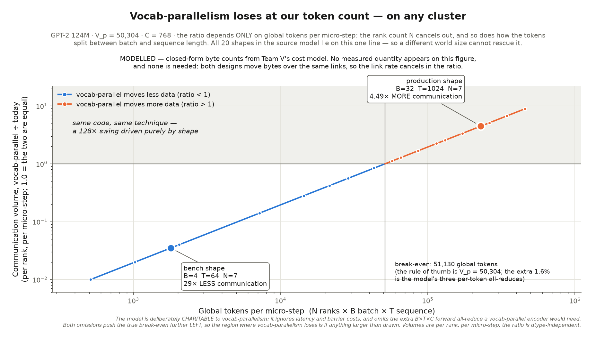

# Figures for the tied-`wte` de-residency campaign: what we measured, what we modelled, and what we would not draw

**Date:** 2026-07-27
**Branch:** `zero/figures`
**Machine:** workstation-max, 8× NVIDIA RTX PRO 6000 Blackwell Max-Q Workstation Edition
**Method:** rendering only — both published figures draw on data already committed to the tree. Neither runs a GPU.

This page documents the campaign's figure set. It is written for a reader who
has not met ZeRO, sharding, data parallelism, or vocabulary parallelism, and
it defines those terms as it goes.

The campaign's goal is to stop the tied token-embedding table `wte`
(`V_p × C` = 50304 × 768 = 38.6M elements = **147 MiB in fp32**) from being
permanently resident, so that ZeRO stages 2 and 3 can fall below a ~150 MiB
floor. The table is *weight-tied*: the same matrix serves both as the
token-embedding lookup and as the final projection that produces one score per
vocabulary entry. Tying the two is standard practice — Press & Wolf recommend
"tying the input embedding and this output embedding" [Press & Wolf], and Inan
et al. describe it as "greatly reducing the number of trainable variables"
[Inan et al.].

---

## The short version

| # | Figure | Status | Data |
|---|--------|--------|------|
| 1 | Exact allocation accounting vs `nvidia-smi` across ZeRO stages | **published** | **measured** (Team M) |
| 2 | Communication break-even, vocab-parallel vs today | **published** | **modelled** (Team V) |
| 3 | GEMM throughput vs vocabulary tile count | **not published** | measurement discarded — see below |
| 4 | Memory-residency timeline across a training step | **dropped** | would have required inventing data |

Three figures were planned as a ceiling, not a target. Two are published. The
reasoning for the two that are not is in
[What we did not publish](#what-we-did-not-publish), and is the most
transferable part of this page.

---

## Figure 1 — the obvious instrument cannot see this


**What ZeRO is.** Training one model across several GPUs normally keeps a full
copy of everything on every GPU, which is wasteful. ZeRO ("Zero Redundancy
Optimizer") removes that duplication in stages. The paper states the taxonomy
directly: "ZeRO-DP has three main optimization stages (as depicted in Figure
1), which correspond to the partitioning of optimizer states, gradients, and
parameters" [ZeRO, Section 1]. So stage 1 splits optimizer state across GPUs,
stage 2 additionally splits gradients, stage 3 additionally splits the
parameters. Each stage should use strictly less memory per GPU than the last.

**The trap.** The obvious way to check that is to read `nvidia-smi`. It does
not work. The CUDA caching allocator commits device memory in 256 MiB chunks,
so `nvidia-smi` only ever moves in 256 MiB steps. Every one of the 16 driver
readings in Team M's baseline is an exact integer multiple of 256 MiB — not one
reading fell off that grid. Real savings of tens of MiB therefore either vanish
entirely, or get rounded into a 256 MiB jump that overstates them.

**Both failure directions are on the figure, and both matter:**

- *Blind to real changes.* In fp32, stages 2 and 3 both read **3000 MiB** while
  their true footprints are 2233.843 and 2173.843 MiB — 60.000 MiB apart. In
  bf16 it is worse: stages 1, 2 and 3 **all** read 2488 MiB, while the true
  footprints are 1635.486 / 1591.964 / 1561.964 MiB, a spread of 73.522 MiB.
  Three distinct configurations, one number.
- *Reporting changes that did not happen at that magnitude.* In fp32, stage
  1 → 2 reads as a clean **256 MiB** drop when the real change is **87.044
  MiB**. The instrument over-reports by 2.9×.

The second is the more dangerous of the two, and it is why "quantized" is not
the same as "noisy". A noisy measurement can be averaged; a quantized one
cannot, and it misleads in both directions.

**Why the figure plots savings relative to stage 0 rather than absolute
totals.** `nvidia-smi` includes a fixed CUDA-context overhead that the
in-process accounting does not — observed at ~696 MiB across most rows and
698 MiB in four of them. Plotting *differences from stage 0* cancels that
offset exactly, so the two instruments become directly comparable without
anyone having to trust a constant. It also has a pleasant consequence: the
y-axis ticks can be set to the allocator's 256 MiB grid, and every `nvidia-smi`
bar then lands exactly on a tick while no exact-accounting bar does. That
coincidence is the whole argument, made visible rather than asserted.

**The buffers this campaign targets are, by construction, invisible to that
instrument.** `grad_pool_buf` is 150.375 MiB in fp32 and `embed_window_buf` is
150.381 MiB — both comfortably below the 256 MiB resolution floor. (They are
genuinely different tensors, not a typo: the pool is `wte`+`wpe`, the window is
`wte`+`wpe`+`ln_f_gamma`+`ln_f_beta`. Both are stage-conditional —
`grad_pool_buf` exists only at stages 2 and 3, `embed_window_buf` only at
stage 3.)

**The proportion panel, and why it is there.** A reader who saw only the
blindness argument could conclude that 150 MiB is a big deal. At a
production-shaped batch it is not the dominant term. The third panel puts the
target against the footprint it comes out of: at B=8, T=1024, fp32, stage 3 the
whole per-GPU footprint is 19,561 MiB, of which activations are 17,808 MiB and
the logits tensor alone is 1,572 MiB. The ~150 MiB this campaign removes is
**0.8%** of that. Both things are true at once, and the figure is built to let
a reader hold both.

That the logits term dominates is not a local quirk. Liger reports that "a 256k
vocabulary size will result in a 16.8 GB logit tensor of bfloat16, causing a
huge spike in the peak memory usage" [Liger, §3.2], and CCE frames
cross-entropy as consuming "an order of magnitude more memory than the rest of
the LLM combined" [CCE].

### Provenance and caveats for figure 1

- **Everything plotted is measured.** Per-buffer and per-class byte counts are
  read off live `DeviceBuffer` objects; `nvidia-smi` values are a
  peak-during-run delta. Values are **per rank** (max over the 2 ranks, which
  are symmetric here), never aggregated.
- **One value is one step removed and is marked with a dagger on the figure:**
  the logits tensor size comes from the model's activation size table rather
  than a direct buffer read, because activation tensors are slices of one large
  allocation. It is already counted inside "all activations" and must not be
  added to any total.
- The 256 MiB granularity and the ~696–698 MiB offset are **findings computed
  by arithmetic from observed data**, not independently instrumented and not
  fitted parameters.
- `exact_total` deliberately excludes the cuBLASLt workspace, the
  `persistent_device_buffer` globals, the KVCache-cached attention scratch and
  pinned host memory, so `exact_total < driver_used` always, by construction.
- `nvidia-smi` is a peak sampled during the run; the exact accounting is read
  at the steady phase. They agree to a near-constant, which is consistent with
  steady == peak for a ratcheting allocator, but that was not independently
  proven and the figure does not assert it.
- **GPU collectives in this tree are verified at world size 2 only**, which is
  exactly the configuration measured here. Extrapolating the stage-2/3 trend to
  larger world sizes is not covered by that verification.
- The B=4/T=64 values reproduced bit-identically across two runs taken hours
  apart under different box load, which is why differences of tens of MiB are
  quoted without error bars.

---

## Figure 2 — vocab-parallelism loses at the shapes we train at



**What vocab-parallelism is.** Megatron-LM splits the embedding matrix across
GPUs along the vocabulary axis: "We parallelize the input embedding weight
matrix E_{H×v} along the vocabulary dimension E=[E_1,E_2] (column-wise)"
[Megatron-LM, Section 3]. Each GPU permanently owns a slice of the vocabulary,
so the table never moves. Instead the GPUs exchange per-token quantities, and
Megatron fuses the parallel GEMM output with the cross-entropy loss "which
reduces the dimension to b×s", because "communicating scalar losses instead of
logits is a huge reduction in communication" [Megatron-LM, Section 3].

**Why there is a crossover.** The two designs scale with different things:

- **Today's approach** gathers the sharded embedding window when it is needed,
  so what crosses the wire is proportional to the **size of the table** and
  does not depend on batch size.
- **Vocab-parallel** never moves the table, so what crosses the wire is
  proportional to the **number of tokens** and does not depend on the table.

One cost is fixed and one grows with the batch, so they cross. Below the
crossing vocab-parallel moves less data; above it, more.

**Where the crossing is.** Team V's model gives, per rank per micro-step:

```
baseline       = 2 * W * (N-1)/N                        W = 39,421,440 elements
vocab-parallel = 2*(N-1)*B*T*C  +  3 * 2*(N-1)/N * N*B*T
```

which simplifies to `ratio = global_tokens × (C+3) / W`, so the ratio depends
**only on global tokens per micro-step** — not on the rank count `N`, and not
on how the tokens split between batch and sequence length. Every one of the 20
distinct shape and sweep points in the source model lands on one straight line
on log-log axes, which is why the figure can draw a single curve.

That `N` cancels is worth pausing on, because it changes what the result
claims. The finding is not "vocab-parallelism loses on our cluster" — it is
**"vocab-parallelism loses at our token count, on any cluster."** It also
closes off the rescue a reader would naturally reach for: you cannot fix this
by choosing a different world size, because the world size never enters the
answer except through `N·B·T`.

Setting that ratio to 1 gives an exact break-even of **51,130 global tokens per
micro-step**. The memorable rule of thumb is `N·B·T < V_p`, i.e. 50,304; the
extra 1.6% is the model's three per-token all-reduces — the `+3` beside `C`.
Three, not two: Megatron's `cross_entropy.py` performs a MAX on `logits_max`, a
SUM on `predicted_logits` and a SUM on `sum_exp_logits` in forward
[Megatron impl].

**Where we sit.** At the bench shape (B=4, T=64, N=7 — 1,792 global tokens)
vocab-parallelism would move **29× less** data. At the production shape
(B=32, T=1024, N=7 — 229,376 global tokens) it moves **4.49× more**. Same code,
same technique, a **128× swing driven purely by shape**. We operate far to the
right of the crossover, and that is why the answer is no.

### Provenance and caveats for figure 2

- **Every number on this figure is MODELLED.** Closed-form byte counts, zero
  measured input. This is stated on the figure face, not only here.
- No measurement is needed and none should be added: both designs move bytes
  over the same links by the same staged-copy mechanism, so the link rate
  cancels in the ratio. There is deliberately **no milliseconds axis** — that
  would require a bandwidth anchor, and the only such figure available in the
  tree is an unverified prose claim in a docstring with no reproducible
  harness behind it.
- The model is deliberately **charitable to vocab-parallelism**: it ignores
  latency and barrier costs, which penalise the small-volume side, and it omits
  the extra `B×T×C` forward all-reduce a vocab-parallel *encoder* would need.
  Both omissions push the true break-even further **left**, so the region where
  vocab-parallelism loses is if anything larger than drawn. A model that bends
  toward the option it rejects is a stronger argument than one that does not,
  which is why this is on the figure rather than buried here.
- The "ignores latency" caveat has since been measured by Team V rather than
  merely asserted: collectives below ~6 MiB are latency-bound rather than
  bandwidth-bound (0.75 MiB runs at 6.7 GB/s against a ~21 GB/s plateau). That
  confirms the small-volume end of the curve — the bench shape — is the
  *optimistic* end for vocab-parallelism. It is recorded here rather than on
  the figure, so that the figure remains unambiguously free of measured data.
- The exact break-even of 51,130 was independently re-derived and confirmed by
  Team V, who corrected their own headline to match. The 1.6% gap from the
  `V_p` rule of thumb is in fact two effects pulling in opposite directions:
  `W = C·(V_p + 1026)` is slightly *more* than `V_p·C` because the gathered
  window also carries `wpe` and the final LayerNorm (pushing the crossover
  right), while the three per-token all-reduces push it left. The net is
  +1.6%.
- The `+3` all-reduce count was verified against Megatron's source rather than
  assumed. Note that Megatron does no collectives in backward because its
  activations are already replicated; a data-parallel hybrid cannot have that
  property and still owes a reduce-scatter of `d_ln_f`.

---

## What we did not publish

### Figure 3 — GEMM throughput vs vocabulary tile count

Vocabulary tiling splits the one large `(B*T, C) × (C, V_p)` LM-head GEMM into
`K` smaller ones so that only one `[B*T, V_p/K]` logits block is resident at a
time. This is mechanically closest to Liger's chunked fused linear
cross-entropy [Liger, §3.2]. Smaller GEMMs can lose efficiency, so a figure
showing what tiling **costs** is the honest counterweight to the memory win.

It is not published, for two independent reasons, either of which alone would
be sufficient.

**1. The measurement was contended, so it was discarded.** The sweep ran while
four full `make test` suites were running concurrently on the same box (load
average 68). Throughput is exactly the kind of quantity that destroys. The data
also failed an internal consistency check that would have caught it
independently: at one tile the M=32768 GEMM measured *slower* per FLOP
(258.9 TFLOP/s) than the smaller M=8192 GEMM (274.7 TFLOP/s), which is
backwards for a larger GEMM at the same K and N. No correction factor was
applied; a contended measurement cannot be rescued arithmetically.

**2. Correctness is established nowhere on the proposed x-axis.** No test in
this tree drives the LM-head matmul above `output_channels=3072`, while the
real head runs at `V_p=50304`. A throughput curve over tile counts would invite
a reader to pick an optimum at a point where the implementation is verified
nowhere — a performance claim wearing the costume of a working-implementation
claim. There is also a second-order problem that a correctness fix alone would
not solve: a `linalg.matmul` N-split sweep is a *different kernel* from a
purpose-written vocab-tiled head, so the shape of the performance curve may not
transfer even if both are correct.

One part of that run does survive, because it is deterministic arithmetic that
contention can delay but not alter: a numerical check of the decomposition
itself, comparing the concatenated tiled result against the untiled full-`N`
reference at M=512, OC=50304. Tile counts 1, 2, 4, 8, 16, 32 and 64 were
**bit-identical** to untiled (`max_abs = 0.0`); at 128 tiles — a tile width of
393 — the result stopped being bit-identical (`max_abs = 6.1e-05` against a
reference magnitude of 0.0162). That is worth recording precisely because
something changes at narrow tile widths, at a tile count a reader might
otherwise have picked off a throughput curve. It will be re-verified on a quiet
box before it is relied on.

The harness written for this is committed as `bench_gemm_vocab_tiles.mojo`. It
deliberately reuses `bench_gemm.mojo`'s methodology — the same
`linalg.matmul[transpose_b=True, target="gpu"]` call, the same warmup/iters
timing shape, the same `2*M*N*K` FLOP count — so its numbers are comparable
with that harness rather than being a new methodology. It allocates the output
block **once** at `[M, V_p/K]` and reuses it across tiles, which is what makes
the logits residency fall as `1/K`.

### Figure 4 — a memory-residency timeline across a training step

Proposed, and dropped. `LLMM_MEM_REPORT` emits at exactly two phases:
`post_alloc` (parameters, gradients, optimizer state and ZeRO-3 windows sized,
activations not yet) and `steady` (after the last step). That is not
forward-versus-backward resolution. Drawing a residency timeline would have
meant reading the code and asserting a shape — inventing data and presenting it
with the authority of a measurement. Prose plus figure 1 carries the point.

---

## Reproducing the figures

```
make figures-wte        # both figures
make figure-blindness   # figure 1 only
make figure-breakeven   # figure 2 only
```

Neither target touches a GPU, so both are safe to run on a busy box and
reproducible anywhere. Each writes `figures/<name>.png` plus a sidecar
`<name>.json` at the same stem. The sidecar carries the source documents
verbatim, the exact plotted series, and a `provenance` block recording
measured-versus-modelled status — so the figure and the data that made it
always travel together.

## Limitations

- Both figures describe GPT-2 124M at world size 2 (figure 1) or a closed-form
  model (figure 2). Neither is a statement about larger models.
- Figure 1's collectives are verified at world size 2 only.
- Figure 2 has no measured component at all and should not be read as one.
- No throughput or step-time claim appears on either figure. Timings moved
  measurably with box load during this work, and nothing time-based was
  considered trustworthy enough to publish.

## AI use statement

Written with AI assistance (Claude Code / Opus agent), directed by Evan Owen.
